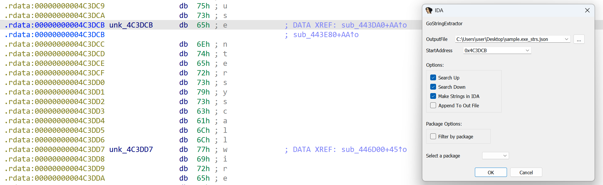
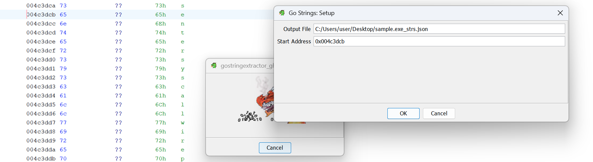

# GoStringExtractor

GoStringExtractor is a tool for IDA Pro and Ghidra to help collect strings from a Go binary.

It collects the strings and the functions that reference each string, then dumps to a JSON file. You can also choose to make the strings inside of IDA Pro/Ghidra for convenience. Here's the result of running GoStringExtractor, it will neatly organize the strings in your Ghidra or IDA Pro database:

## Installation

### IDA Pro
To install the IDA Pro plugin, download both `gostringextractor_ida.py` and `ida-plugin.json`. Then navigate to your IDA Pro folder (if you do not have a plugins folder, just make one):

Windows:
`%APPDATA%\Hex-Rays\Ida Pro\plugins`

Mac:
`~/.idapro/plugins`

Then make a directory called `gostringextractor` and copy the files into it. You should now be able to find it in IDA Pro by going to `Edit > Plugins > GoStringExtractor`, or by pressing `Shift-S` which is the default hotkey (which you can customize in the JSON file).

### Ghidra
To install the Ghidra script, download `gostringextractor_ghidra.py`, then navigate to your Ghidra installation directory. Then move the file into
`\Features\PyGhidra\ghidra_scripts`. 

You should now be able to find it in Ghidra by going to `Windows > Script Manager > gostringextractor_ghidra.py` and then running the script.

## Usage
Before running GoStringExtractor, it's a good idea to let auto-analysis run, especially for Ghidra. Letting analysis run will make the cross-references inside the data segments that the tool uses to construct the strings

Once you've launched GoStringExtractor, you will see a dialog (or multiple sequential ones, if you're using the tool for Ghidra). 

The tool will provide an option to rename the output file; the default naming convention uses the name of the binary imported into the database. There is also an option to append to an existing output file, however note that the file must already exist for you to do this. 

The default start address for the search is given by searching for the string `"entersyscall"` in the binary's data segments. It's a string that is found in every version of Go (for now) and gives a pretty consistent entry into the string table. If you have a different starting point you'd like to start from, you can change it. 

You will also be prompted to select whether you want to search up or down (or both) from the provided address, which will iterate to the top and bottom of the string table.

There is also a convenient option to make the strings in your database, whether that's in IDA Pro or Ghidra, so that your strings can be named which makes them clickable, cross-referencable, and easier to find. 

Finally, you can choose to filter the strings by package name, meaning that you will only extract the strings used in functions of a certain package. There is a dropdown with all the packages which are extracted from the function information in the database.

*Note: This tool does not unscramble strings that are obfuscated. In the case of an obfuscator such as Garble, the tool will still be able to successfully enter the string table and make all of the unobfuscated runtime strings.*
